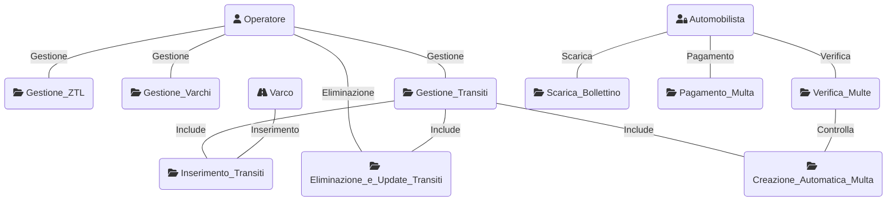

# Progetto Programmazione Avanzata A.A. 23/24

## Obiettivo

## Progettazione

### Architettura

### Diagramma dei casi d'uso

## API

## Set-up

## Strumenti utilizzati

## Autori 

|Nome | GitHub |
|-----------|--------|
| 👩 **Agresta Arianna** | [Click here](https://github.com/Arianna6400) |
| 👨 **Iasenzaniro Andrea** | [Click here](https://github.com/AndreaIasenzaniro) |
