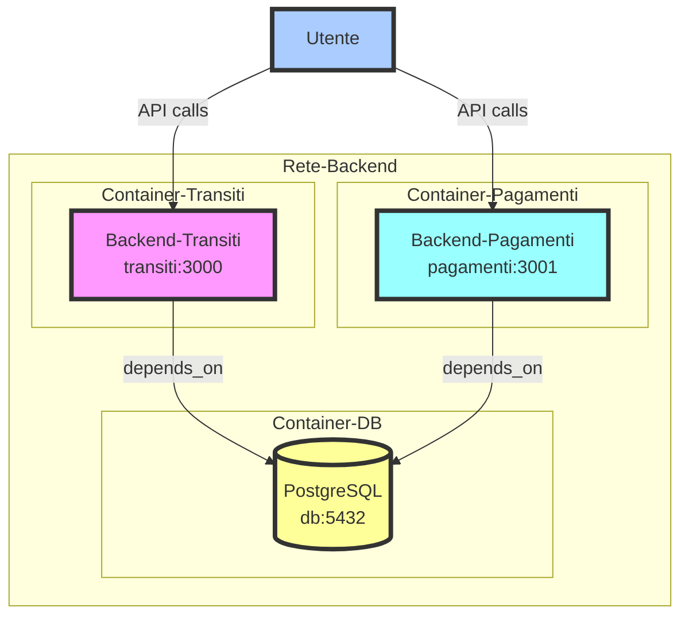
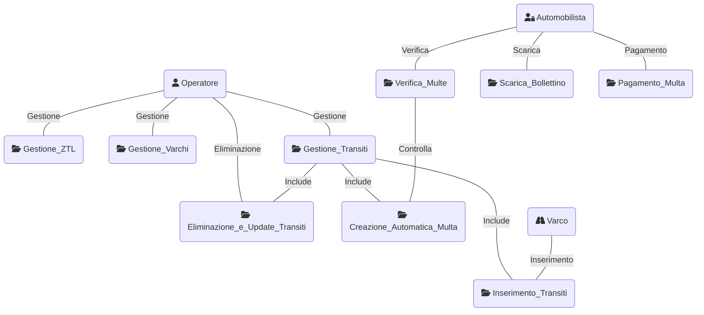
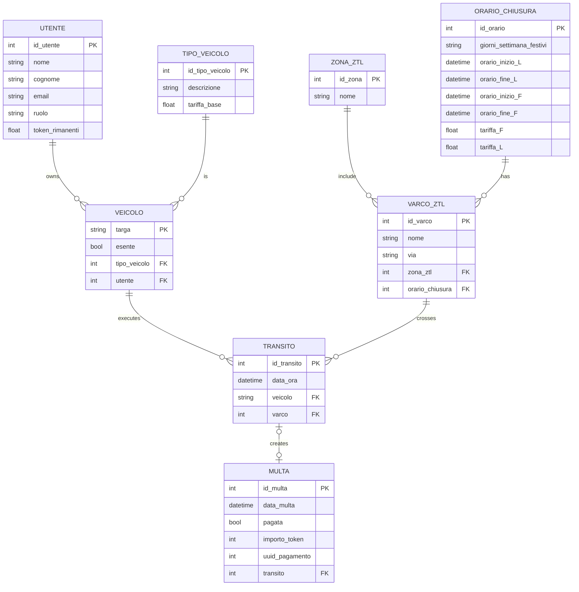

# Progetto Programmazione Avanzata A.A. 23/24

# Indice

1. [Obiettivo](#obiettivo)
2. [Progettazione](#progettazione)
   1. [Architettura dei servizi](#architettura-dei-servizi)
   2. [Diagramma dei casi d'uso](#diagramma-dei-casi-duso)
   3. [Diagramma E-R](#diagramma-e-r)
3. [API](#api)
4. [Set-up](#set-up)
5. [Strumenti utilizzati](#strumenti-utilizzati)
6. [Autori](#autori)

## Obiettivo

## Progettazione

### Architettura dei servizi

### Diagramma dei casi d'uso

### Diagramma E-R

## API

## Set-up

## Strumenti utilizzati

## Autori 

|Nome | GitHub |
|-----------|--------|
| 👩 **Agresta Arianna** | [Click here](https://github.com/Arianna6400) |
| 👨 **Iasenzaniro Andrea** | [Click here](https://github.com/AndreaIasenzaniro) |
