# Progetto Programmazione Avanzata A.A. 23/24


 

# Indice

- [Obiettivo](#-obiettivo)
- [Progettazione](#-progettazione)
   - [Architettura dei servizi](#-architettura-dei-servizi)
   - [Diagramma dei casi d'uso](#-diagramma-dei-casi-duso)
   - [Diagramma E-R](#-diagramma-e-r)
   - [Pattern utilizzati](#-pattern-utilizzati)
   - [Diagrammi delle sequenze](#-diagrammi-delle-sequenze)
- [API Routes](#-api-routes)
- [Set-up](#-set-up)
- [Scelte implementative da sottolineare](#-scelte-implementative-da-sottolineare)
- [Strumenti utilizzati](#-strumenti-utilizzati)
- [Autori](#-autori)

## 📌 Obiettivo

L'obiettivo del progetto consiste nello sviluppo di un sistema per la gestione del calcolo delle multe dovute al passaggio di veicoli attraverso varchi ZTL (Zone a Traffico Limitato) in una città. Il sistema deve consentire:

* La gestione delle diverse tipologie di veicoli, ciascuna con costi di transito differenti.
* La modellazione dei varchi ZTL, che possono essere aperti o chiusi in specifici orari del giorno e della settimana. 
* L'inserimento dei transiti dei veicoli, con data e ora del passaggio e targa del veicolo.
* Il calcolo automatico delle multe in base alla tipologia del veicolo, alla fascia oraria e al giorno della settimana, tenendo conto di eventuali esenzioni di alcuni veicoli. Le tariffe relative ai varchi saranno differenziate anche a seconda del passaggio in giorni e orari festivi o feriali.

L'intero sistema prevede due backend distinti: uno per la gestione dei **transiti** e uno per la gestione dei **pagamenti** delle multe, ciascuno con funzionalità specifiche accessibili tramite rotte API.

## 🏗️ Progettazione

### 🖥️ Architettura dei servizi

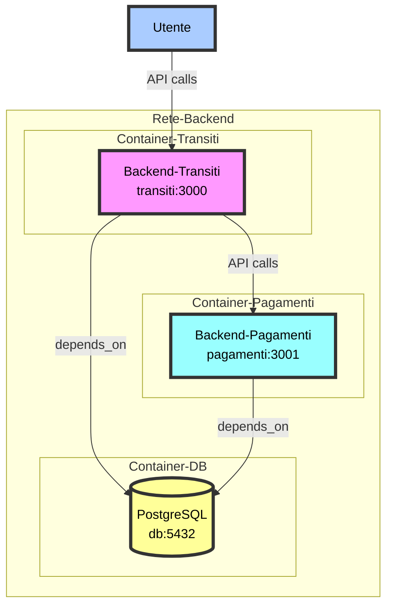

Il diagramma rappresenta l'intera architettura del sistema sviluppato. All'interno della rete backend ci sono tre container principali, i quali rappresentano i servizi `Docker`, orchestrati tramite `docker-compose`, che compongono l'applicazione. 

Il container Transiti ospita un servizio chiamato "**backend-transiti**", accessibile all'indirizzo `transiti:3000`, mentre il container Pagamenti contiene il servizio "**backend-pagamenti**", accessibile all'indirizzo `pagamenti:3001`. Il container del DB, invece, contiene un database **PostgreSQL** accessibile all'indirizzo `db:5432`.

L'utente finale, rappresentato da un elemento separato nel diagramma, interagisce con il sistema inviando chiamate API alla rete backend. Entrambi questi i servizi introdotti dipendono dal database PostgreSQL, il che significa che per funzionare correttamente devono poter accedere ai dati memorizzati in esso. Questa struttura permette una chiara separazione dei servizi e una gestione centralizzata dei dati tramite il database PostgreSQL.

L'architettura dei servizi si riflette sulla struttura stessa dell'intero progetto. Le directory, infatti, sono organizzate come di seguito:

```plaintext
project
├── backend-pagamenti
│   ├── src
│   │   ├── controllers
│   │   ├── dao
│   │   ├── middleware
│   │   ├── models
│   │   ├── routes
│   │   ├── utils
│   │   └── app.ts
│   │   └── server.ts
│   ├── Dockerfile
│   ├── package.json
│   └── tsconfig.json
├── backend-transiti
│   ├── src
│   │   ├── controllers
│   │   ├── dao
│   │   ├── middleware
│   │   ├── models
│   │   ├── repositories
│   │   ├── routes
│   │   ├── utils
│   │   └── app.ts
│   │   └── server.ts
│   ├── Dockerfile
│   ├── package.json
│   └── tsconfig.json
├── database
│   ├── init.sql
└── docker-compose.yml
```

### 📊 Diagramma dei casi d'uso

Il diagramma dei casi d'uso mostrato di seguito offre una visualizzazione delle funzioni e/o servizi offerti dal sistema sviluppato, a seconda del livello di utenza che interagisce col sistema stesso.

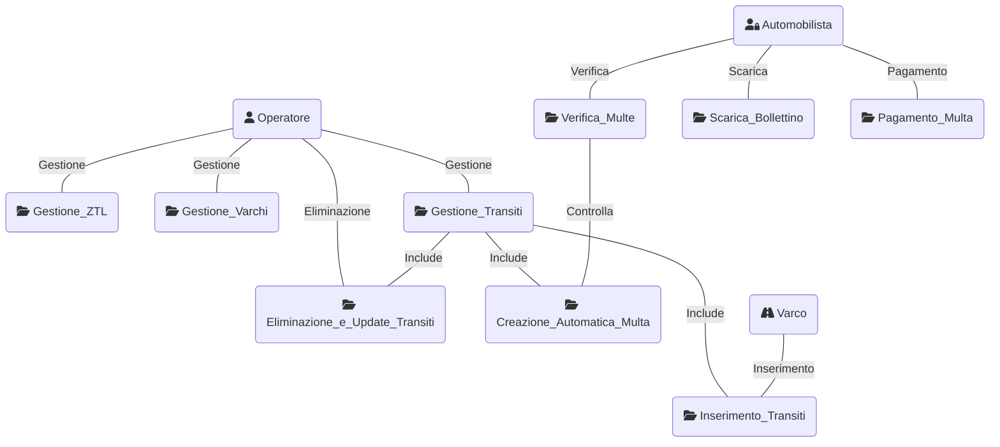

### 🗂️ Diagramma E-R

Il RDBMS scelto per la realizzazione del sistema è **PostgreSQL**, un database open source che gode di una solida reputazione per affidabilità, flessibilità e scalabilità. In particolare, in un contesto di backend puro come quello del sistema sviluppato, in cui è necessaria l'autenticazione dei dati e la velocità di lettura/scrittura, PostgreSQL è uno dei sistemi di basi di dati più efficiente e ottimizzato. 

Di seguito, viene mostrato il diagramma "Entity-Relationship"(E-R) di rappresentazione concettuale e grafica delle classi all'interno del database utilizzato.

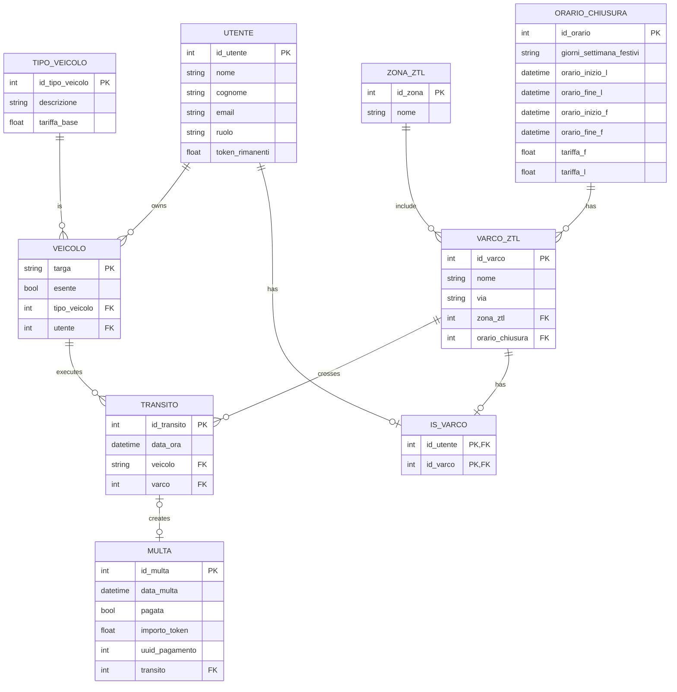

### 🧱 Pattern utilizzati

**Model-View-Controller (MVC)**

Il pattern architetturale scelto per la struttura del sistema è il **Model-View-Controller** (**MVC**), il quale permette di separare la presentazione e l'interazione dai dati del sistema, facilitando la manutenzione e l'evoluzione del codice. L'utilizzo di questo pattern prevede la separazione dell'applicazione in tre componenti logiche che interagiscono tra loro:

* **Model**: Rappresenta i dati e la logica dell'applicazione. È responsabile della gestione dello stato e dell'interazione con il database. Nel caso del sistema sviluppato, i Model sono definiti utilizzando [Sequelize](https://sequelize.org/), un framework per l'Object-Relational Mapping (ORM) per interagire con il database.

* **Controller**: Gestisce l'interazione dell'utente e le operazioni CRUD (Create, Read, Update, Delete). Interagisce con i livelli sottostanti per eseguire le operazioni richieste e restituire le risposte appropriate. Nel sistema sviluppato, i Controller recuperano i dati necessari dai Repository (se previsti) o dai DAO, eseguendo le operazioni e i metodi specifici che verranno poi utilizzati dalle Routes API.

* **View**: Rappresenta i dati recuperati dal modello, gestendo la logica di presentazione. Nel caso specifico del sistema sviluppato, che risulta essere un backend puro, la componente logica della View non è stata propriamente sviluppata. Tuttavia, **Postman** viene utilizzato per fornire una visualizzazione dei dati in formato JSON, a seconda della richiesta inoltrata.

**Data Access Object (DAO)**

Per astrarre la logica di accesso ai dati, indipendentemente dal tipo di meccanismo di memorizzazione utilizzato, è stato scelto il pattern **Data Access Object** (**DAO**). Esso fornisce un'interfaccia astratta comune per eseguire operazioni CRUD e altre operazioni di accesso ai dati, isolando il codice di accesso ai dati dal codice di business.

Il DAO presenta diverse componenti: l'*interfaccia* di definizione dei metodi di accesso ai dati che devono essere implementati, l'*implementazione* concreta dei metodi definiti dall'interfaccia DAO che contiene il codice specifico di interazione con le fonti di dati e le *classi di entità*, cioè i Model, che rappresentano i dati che vengono manipolati dal DAO. Queste ultime classi sono mappate alle tabelle del database.

L'utilità principale del pattern è rappresentata dal fatto che ad un singolo Model viene corrisposto un singolo DAO, garantendo l'accesso ai dati necessari, e, soprattutto, uno o più DAO possono essere richiamati da componenti superiori quali **Repository** (se previsto) o **Controller**, per l'utilizzo combinato dell'accesso ai dati. In questo modo, non solo è garantita un'elevata riutilizzabilità del codice in diverse parti dell'applicazione, ma soprattutto viene implementata una forte modularità e separazione delle responsabilità da parte di tutte le componenti.

**Repository**

Per avere una centralizzazione della logica di accesso ai dati e offrire un'interfaccia coerente per il resto dell'applicazione, è stato utilizzato il pattern **Repository**, il quale fornisce un'astrazione dell'accesso ai dati, nascondendo i dettagli di come i dati vengono effettivamente recuperati o memorizzati. 

Centralizzando la logica di accesso ai dati, un Repository permette di trattare le entità come se fossero raccolte di memoria, fornendo metodi per aggiungere, rimuovere e recuperare oggetti. Al suo interno, il Repository fornisce l'implementazione concreta dei metodi necessari, utilizzando i DAO come tecnica di persistenza per l'interazione con le classi di dato.

Mentre il DAO lavora ad un livello più basso, vicino al database, per eseguire operazioni CRUD, il Repository fornisce un livello di astrazione superiore, incapsulando la logica di accesso ai dati e utilizzando uno o più DAO per realizzare le operazioni di persistenza. Il vantaggio principale del Repository consiste proprio nella capacità di astrazione sopra il livello di persistenza, consentendo di cambiare facilmente l'implementazione senza influenzare il resto dell'applicazione.

**Chain Of Responsability (COR)**

Il pattern **Chain of Responsability** (**COR**) è un design pattern comportamentale che permette di passare le richieste lungo catene di gestori, che sono rappresentati da oggetti che possono gestire la richiesta o passarla all'oggetto successivo della catena. L'utilizzo di questo pattern permette una gestione accurata delle richieste, senza l'effettiva conoscenza degli oggetti coinvolti da parte del mittente.

I *middleware*, in particolare, permettono la creazione della catena di responsabilità, poiché [Express.js](https://expressjs.com/) stesso fa un ampio uso di questo pattern. I middleware, infatti, sono funzioni che vengono eseguite in sequenza per gestire le richieste HTTP. Sfruttando il COR, sono state implementate le seguuenti funzionalità dei middleware:

* **Middleware di autenticazione**: Verifica se l'utente è autenticato e autorizzato a eseguire l'operazione richiesta, sfruttando la verifica tramite **JWT**. Se non lo è, restituisce una risposta di errore; altrimenti, passa la richiesta al prossimo middleware.

* **Middleware di validazione**: Viene utilizzato per validare i dati di una richiesta, che possono essere passati come `param` o `body`. Se i dati non sono validi, restituisce una risposta di errore; altrimenti, passa la richiesta al prossimo middleware.

* **Middleware di gestione degli errori**: Intercetta eventuali errori verificatisi nei middleware precedenti e restituisce una risposta di errore appropriata, sfruttando un `errorHandler` personalizzato con il pattern **Factory**.

**Factory**

Per la gestione personalizzata degli errori è stato scelto l'utilizzo del design pattern comportamentale **Factory**, il quale permette di delegare la creazione di oggetti a una factory (fabbrica), che decide quale tipo di oggetto creare in base a certi parametri. 

All'interno del sistema sviluppato, il pattern è stato utilizzato per la creazione di errori personalizzati attraverso l'`errorFactory`, che fornisce un metodo per creare istanze di errori `HttpError` con diversi tipi e messaggi, sfruttando anche l'utilizzo della libreria `http-status-code` per la stampa dei codici di errore, incapsulando la logica di creazione degli errori in un'unica classe. In questo modo, risulta particolarmente facilitata la gestione e la possibile estensione degli errori, essendo l'intera logica localizzata in un unico punto.

**Singleton**

Poiché l'intero sistema è composto da due backend distinti che condividono i dati dello stesso database e, di conseguenza, attingono dalla stessa fonte, è stato necessario l'utilizzo di un design pattern creazionale, chiamato **Singleton**, che garantisce la presenza di una classe con una sola istanza, che fornisce un punto di accesso globale ad essa. L'implementazione del pattern è stata eseguita proprio attraverso l'utilizzo del metodo `getInstance()`, il quale garantisce l'istanza di connessione condivisa al database.

Per la gestione delle risorse condivise, come la connessione al DB, questo pattern risulta particolarmente efficace. In questo modo, oltre a garantire una sola connessione condivisa tra le varie parti dell'applicazione, vengono evitati problemi di concorrenza e viene migliorata l'efficienza delle risorse.

### 🔄 Diagrammi delle sequenze

I diagrammi delle sequenze permettono di illustrare la sequenza di messaggi di richiesta e risposta tra un gruppo di oggetti che interagiscono tra di loro. Essi offrono una rappresentazione utile alla comprensione della comunicazione tra le varie entità, perciò sono particolarmente consigliati per mostrare il processo di interazione in un contesto basato su rotte API. Poiché il sistema sviluppato presenta numerose rotte relative alle principali operazioni CRUD (Create, Read, Update, Delete), è stato deciso di mostrare solamente i diagrammi delle rotte più significative e complesse per entrambi i backend sviluppati. In particolare, vengono mostrate rotte di tipo GET e/o POST, più l'aggiunta di una DELETE; le rotte PUT per l'Update non sono state inserite, essendo tutte molto simili tra loro.

🚌 **Backend-Transiti**

* __POST /login__

La seguente rotta rappresenta la base d'autenticazione dell'intero sistema, in cui l'utente invia una richiesta di autenticazione con credenziali all'`authMiddleware`. Quest'ultimo interagisce con l'ambiente di esecuzione, rappresentato dal file `.env`, chiedendo la chiave segreta, cioè il **JWT Secret**. Una volta restituita la chiave al middleware, viene generato un token firmato con la chiave segreta, contenente le informazioni di autenticazione dell'utente, che viene restituito all'utente.

A questo punto, l'utente invia una richiesta con il token al middleware di autenticazione, che esegue il processo di verifica inverso utilizzando la chiave segreta dell'ambiente di esecuzione. Se il token è valido, la libreria JWT restituisce il payload decodificato al middleware, il quale concede l'accesso all'utente. Se il token non è valido, la libreria restituisce un valore `null`, generando un errore e restituendo un messaggio di accesso negato all'utente. 

Il JWT restituito all'utente, poi, verrà consumato per fare le richieste API, ove necessaria l'autenticazione dell'utente.

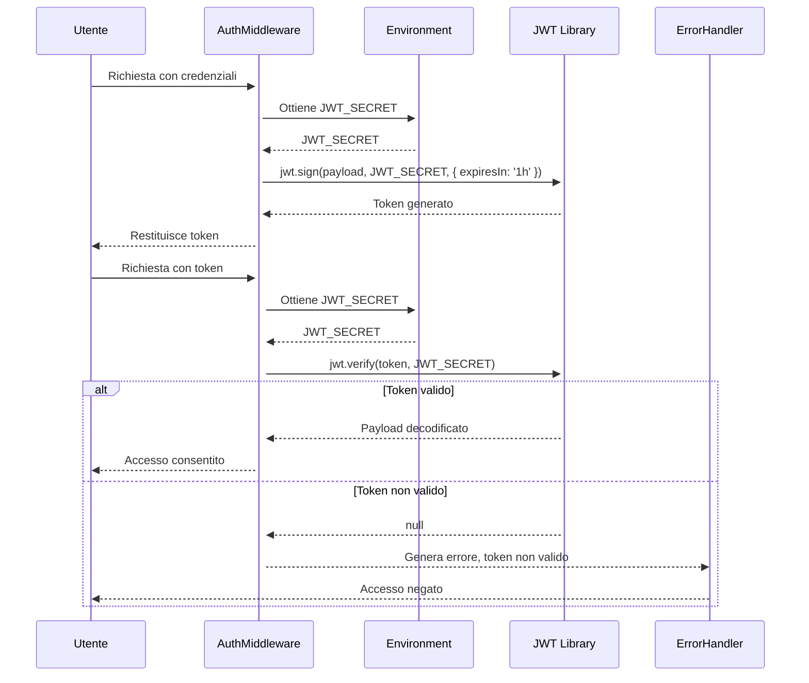

* __GET /varchi/:id/transiti__

Questa rotta rappresenta una chiamata di tipo GET, relativa alla stampa delle informazioni relative ai varchi ZTL. L'utente invia una richiesta con un token all'`authMiddleware`, il quale verifica il token e il ruolo dell'utente. Se il token è valido e l'utente è autorizzato, Auth passa il controllo al Controller, il quale invia una richiesta al Repository per ottenere il varco ZTL e i suoi transiti, fornendo l'ID del varco. Il repository contatta il DAO del varco ZTL per ottenere il varco ZTL per ID. Se il varco viene trovato, il DAO lo restituisce al Repository; in caso contrario, restituisce *null*, e il Repository comunica al Controller che il varco ZTL non è stato trovato, il quale a sua volta informa l'utente.

Successivamente, il Repository invia una richiesta al DAO della zona ZTL per ottenere la zona ZTL per ID del varco ZTL. Se la zona viene trovata, il DAO la restituisce al Repository; se non viene trovata, restituisce *null*, e il Repository comunica al Controller che la zona ZTL non è stata trovata, il quale informa l'utente. Lo stesso processo viene ripetuto per ottenere l'orario di chiusura tramite il DAO dell'orario di chiusura. Se l'orario di chiusura viene trovato, viene restituito al Repository; se non viene trovato, viene restituito *null*, e il Repository comunica al Controller che l'orario di chiusura non è stato trovato, il quale informa l'utente.

Il Repository invia quindi una richiesta al DAO dei transiti per ottenere tutti i transiti. Se i transiti vengono trovati, il DAO li restituisce al Repository, il quale invia poi una richiesta al DAO del veicolo per ottenere il veicolo per ID del transito. Se il veicolo viene trovato, viene restituito al Repository; se non viene trovato, viene restituito *null*.

Se tutti i dettagli del varco ZTL, della zona, dell'orario di chiusura, dei transiti e dei veicoli sono stati trovati, il Repository restituisce al Controller il varco ZTL con tutti i dettagli e i transiti. Il Controller, infine, restituisce all'utente il varco ZTL con i transiti. Se alcuni dettagli non sono stati trovati, il Controller informa l'utente del problema specifico (varco ZTL, zona ZTL, orario di chiusura, transiti o veicoli non trovati).

Se l'utente non è autorizzato, il middleware genera un errore e lo comunica al gestore degli errori, che restituisce un messaggio di accesso non autorizzato all'utente.

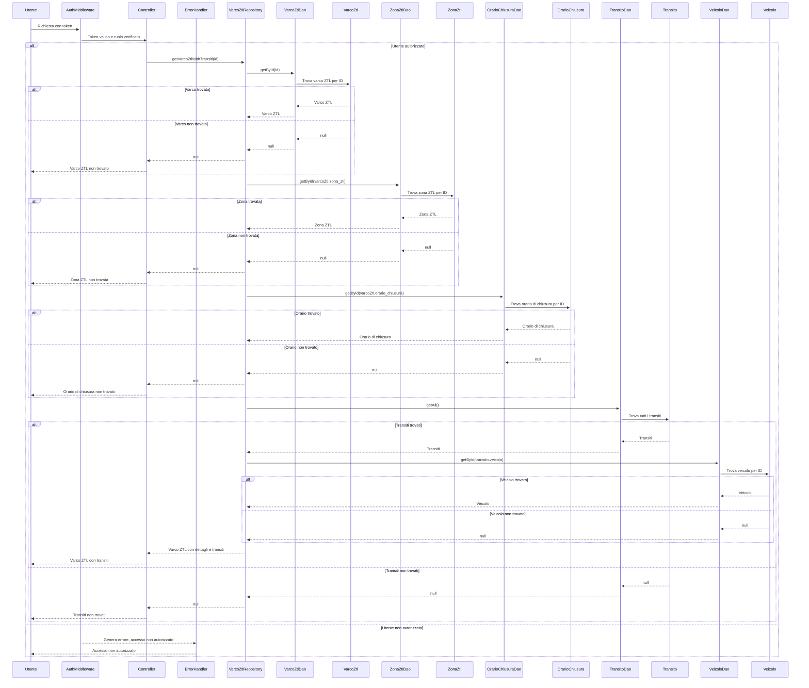

* __POST /varcoZtl__

Nella seguente rotta di tipo POST, relativa alla creazione di un nuovo varco ZTL, l'utente invia una richiesta con il proprio token al middleware di autenticazione, che ne verifica la validità e il ruolo dell'utente stesso. Se l'utente è autorizzato, `authMiddleware` passa il controllo al Controller, che richiede al Repository di creare un nuovo varco ZTL utilizzando i dati forniti nella richiesta.

Il Repository ottiene un'istanza del database e avvia una transazione. Successivamente, il repository chiama il DAO del varco ZTL per creare un nuovo varco ZTL con i dati forniti. Se il varco viene creato con successo, il DAO restituisce il nuovo varco al Repository. Se la creazione del varco fallisce, il Repository effettua un *rollback* della transazione, comunica l'errore al Controller, che a sua volta genera un errore e informa l'utente.

Dopo la creazione del varco, il Repository chiama il DAO dell'utente per creare un nuovo utente associato al varco. Se l'utente viene creato con successo, il DAO restituisce il nuovo utente al Repository. Se la creazione dell'utente fallisce, il Repository effettua un *rollback* della transazione, comunica l'errore al Controller, che genera un errore e informa l'utente.

Infine, il Repository chiama il DAO dell'associazione `is_varco` per creare l'associazione tra il varco e l'utente. Se l'associazione viene creata con successo, il DAO restituisce l'associazione al Repository, che effettua il *commit* della transazione e comunica al Controller che il varco è stato creato con successo. Il Controller informa quindi l'utente del successo. Se la creazione dell'associazione fallisce, il Repository effettua un *rollback* della transazione, comunica l'errore al controller, che genera un errore e informa l'utente.

Se l'utente non è autorizzato, il middleware comunica il fallimento dell'autorizzazione al Controller, che genera un errore e informa l'utente che l'accesso non è autorizzato.

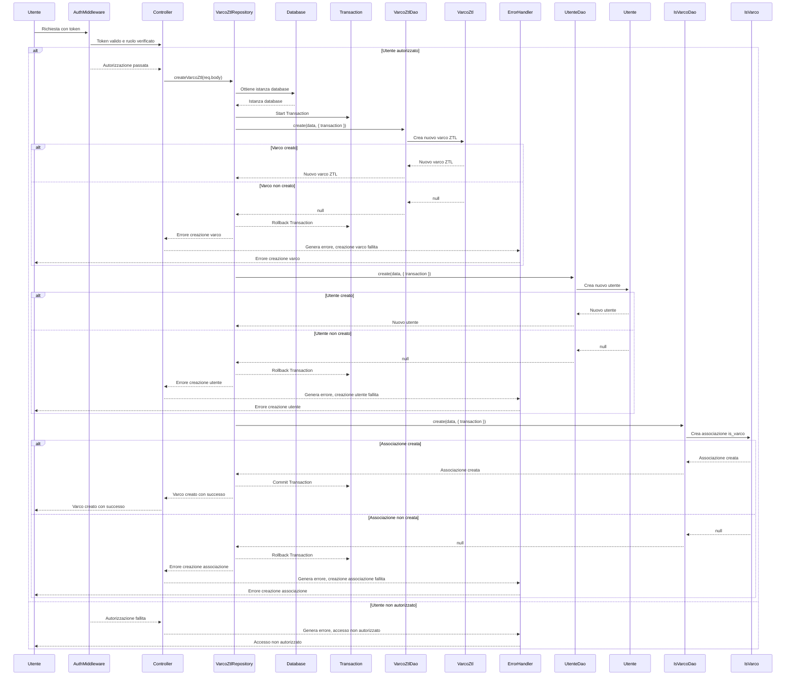

* __DELETE /zonaZtl/:id__   

In questa rotta di tipo DELETE, l'utente invia una richiesta con un token al middleware di autenticazione, che verifica la validità del token e il ruolo dell'utente. Se l'utente è autorizzato, il middleware passa il controllo al Controller, il quale richiede al Repository di eliminare una zona ZTL specificata dall'ID.

Il Repository interroga il DAO del varco ZTL per verificare se ci sono varchi associati alla zona ZTL; se vengono identificati dei varchi associati, il DAO lo comunica al Repository, che a sua volta informa il controller dell'impossibilità di eliminare la zona con varchi associati. Il Controller genera un errore tramite l'`errorHandler` e l'utente viene informato dell'impossibilità di eliminare la zona.

Se non vengono trovati varchi associati, il DAO lo comunica al Repository. A questo punto, il Repository chiama il DAO della zona ZTL per eliminare la zona ZTL specificata. Se la zona viene eliminata con successo, il DAO lo comunica al Repository, che a sua volta informa il Controller del successo dell'operazione. Quest'ultimo informa quindi l'utente che la zona ZTL è stata eliminata con successo.

Se la zona non viene trovata, il DAO lo comunica al Repository, che informa il Controller dell'errore, il quale genera un errore tramite il gestore degli errori e l'utente viene informato che la zona ZTL non è stata trovata.

Se l'utente non è autorizzato, `authMiddleware` comunica il fallimento dell'autorizzazione al Controller, che genera un errore tramite il gestore degli errori e informa l'utente che l'accesso non è autorizzato.

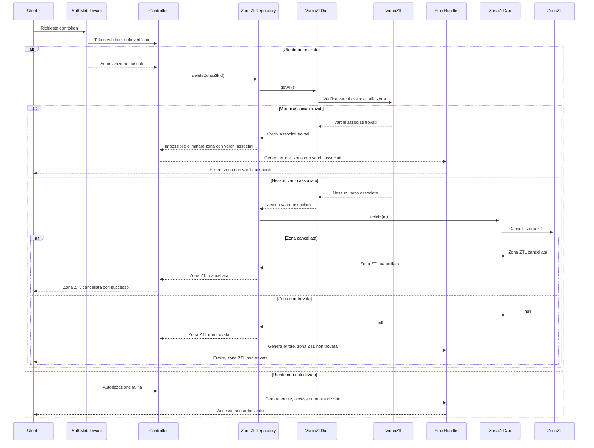

* __GET /transiti/:id__

La seguente rotta GET riguarda la stampa delle informazioni associate ad un transito con un determinato ID, inserito dall'utente steesso. L'utente invia una richiesta con un token al middleware di autenticazione, che verifica la validità del token e il ruolo dell'utente. Se l'utente è autorizzato, passa il controllo al Controller, che richiede al Repository dei transiti di ottenere un transito specificato dall'ID.

Il Repository interroga il DAO del transito per ottenere il transito corrispondente all'ID fornito. Se il transito viene trovato, il DAO lo restituisce al Repository, che a sua volta lo comunica al Controller. Se il transito non viene trovato, il DAO restituisce *null* al Repository, che informa il Controller dell'errore. Il Controller genera un errore tramite il gestore degli errori e l'utente viene informato che il transito non è stato trovato.

Successivamente, il Repository interroga il DAO del veicolo per ottenere i dettagli del veicolo associato al transito. Se il veicolo viene trovato, il DAO lo restituisce al Repository. Se il veicolo non viene trovato, il DAO restituisce *null* al Repository, che informa il Controller dell'errore. Il Controller genera un errore tramite il gestore degli errori e l'utente viene informato che il veicolo non è stato trovato.

Il Repository interroga poi il DAO del varco ZTL per ottenere i dettagli del varco associato al transito. Se il varco viene trovato, il DAO lo restituisce al Repository; se non viene trovato, il DAO restituisce *null* al Repository, che informa il Controller dell'errore. Il Controller genera un errore tramite il gestore degli errori e l'utente viene informato che il varco ZTL non è stato trovato.

Se tutti i dettagli del transito, del veicolo e del varco ZTL vengono trovati, il Repository restituisce queste informazioni al Controller, che a sua volta le comunica all'utente, fornendo i dettagli completi del transito. Se l'utente non è autorizzato, il middleware comunica il fallimento dell'autorizzazione al Controller, che genera un errore tramite il gestore degli errori e informa l'utente che l'accesso non è autorizzato.

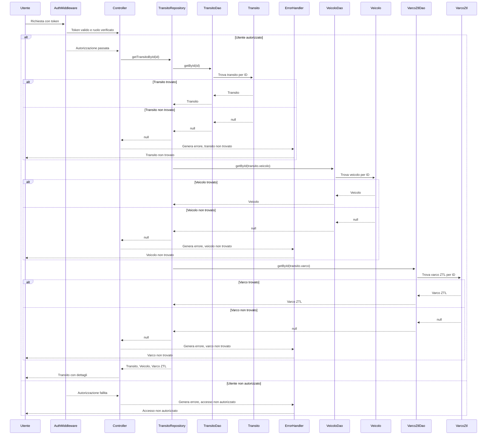

* __POST /transiti__

Questa chiamata di tipo POST si riferisce all'inserimento di un nuovo transito. L'utente invia una richiesta con un token all'`authMiddleware`, che verifica la validità del token e il ruolo dell'utente. Se l'utente è autorizzato, passa il controllo al Controller, che richiede al Repository dei transiti di creare un nuovo transito utilizzando i dati forniti nella richiesta.

Il Repository ottiene un'istanza del database e avvia una transazione. Successivamente, il Repository chiama il DAO del transito per creare un nuovo transito con i dati forniti. Il DAO crea il nuovo transito e lo restituisce al Repository.

Il Repository quindi interroga il DAO del veicolo per ottenere i dettagli del veicolo associato al transito. Se il veicolo viene trovato, il DAO lo restituisce al Repository. Se il veicolo non viene trovato, il DAO restituisce *null* al Repository, che effettua un *rollback* della transazione e informa il Controller dell'errore. Il Controller genera un errore tramite il gestore degli errori e l'utente viene informato dell'errore nella creazione del transito.

Successivamente, il Repository interroga il DAO del varco ZTL per ottenere i dettagli del varco associato al transito. Se il varco viene trovato, il DAO lo restituisce al Repository. Se il varco non viene trovato, il DAO restituisce *null* al Repository, che effettua un *rollback* della transazione e informa il Controller dell'errore. Il Controller genera un errore tramite il gestore degli errori e l'utente viene informato dell'errore nella creazione del transito.

Se tutti i dettagli del transito, del veicolo e del varco ZTL vengono trovati, il Repository verifica se è necessario calcolare una multa per il nuovo transito. Se è necessario, il Repository chiama il DAO della multa per calcolare e creare la multa. Il DAO calcola e crea la multa, restituendola al Repository. Il Repository effettua il *commit* della transazione e comunica al Controller che il nuovo transito e la multa sono stati creati con successo. Il Controller informa quindi l'utente del successo dell'operazione. Invece, se non è necessario calcolare una multa, il Repository effettua il *commit* della transazione e comunica al Controller che il nuovo transito è stato creato con successo. Il Controller informa quindi l'utente del successo dell'operazione.

Se l'utente non è autorizzato, il middleware di autenticazione comunica il fallimento dell'autorizzazione al Controller, che genera un errore tramite il gestore degli errori e informa l'utente che l'accesso non è autorizzato.

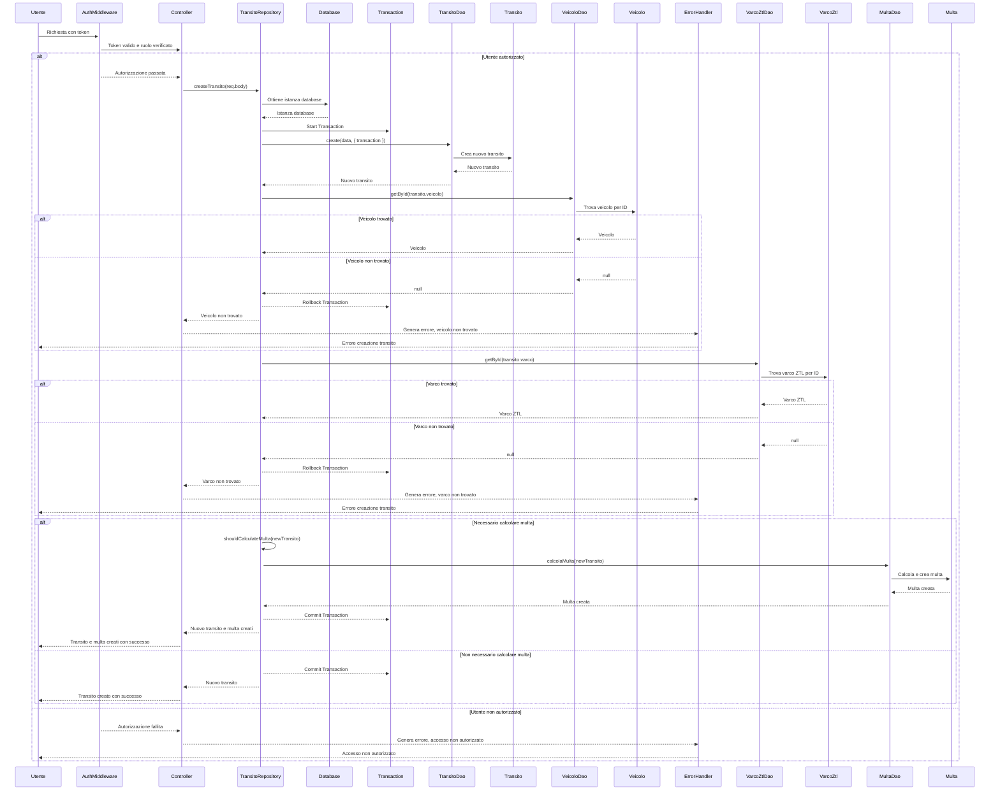

* __GET /multe/bollettino/:uuid__

La seguente chiamata GET si riferisce alla stampa di un bollettino di pagamento in formato PDF, contenente le informazioni associate ad una multa con un dato UUID. L'utente invia una richiesta con un token al middleware di autenticazione, che verifica la validità del token e il ruolo dell'utente. Se l'utente è autorizzato, viene passato il controllo al Controller, il quale richiede al Repository delle multe di ottenere i dettagli di una multa specificata dall'UUID e dall'ID dell'utente.

Il Repository interroga il DAO della multa per ottenere la multa corrispondente all'UUID fornito. Se la multa viene trovata, il DAO la restituisce al Repository. Se la multa non viene trovata, il DAO restituisce *null* al Repository, che informa il Controller dell'errore. Il Controller genera un errore tramite l'`errorHandler` e l'utente viene informato che la multa non è stata trovata.

Successivamente, il Repository interroga il DAO del transito per ottenere i dettagli del transito associato alla multa. Se il transito viene trovato, il DAO lo restituisce al Repository. Se il transito non viene trovato, il DAO restituisce *null* al Repository, che informa il Controller dell'errore. Il Controller genera un errore tramite il gestore degli errori e l'utente viene informato che il transito non è stato trovato.

Il Repository interroga poi il DAO del veicolo per ottenere i dettagli del veicolo associato al transito. Se il veicolo viene trovato, il DAO lo restituisce al Repository. Se il veicolo non viene trovato, il DAO restituisce *null* al Repository, che informa il controller dell'errore. Il Controller genera un errore tramite il gestore degli errori e l'utente viene informato che il veicolo non è stato trovato.

Se tutti i dettagli della multa, del transito e del veicolo vengono trovati, il Repository restituisce queste informazioni al Controller. Il Controller richiede quindi la generazione di un codice QR con una stringa specifica. Una volta generato, il codice QR viene restituito al Controller il quale, successivamente, chiede la creazione di un documento PDF contenente la multa, il transito, il veicolo e il codice QR. Il PDF viene creato e restituito all'utente come bollettino PDF.

Se l'utente non è autorizzato, il middleware comunica il fallimento dell'autorizzazione al Controller, che genera un errore tramite il gestore degli errori e informa l'utente che l'accesso non è autorizzato.

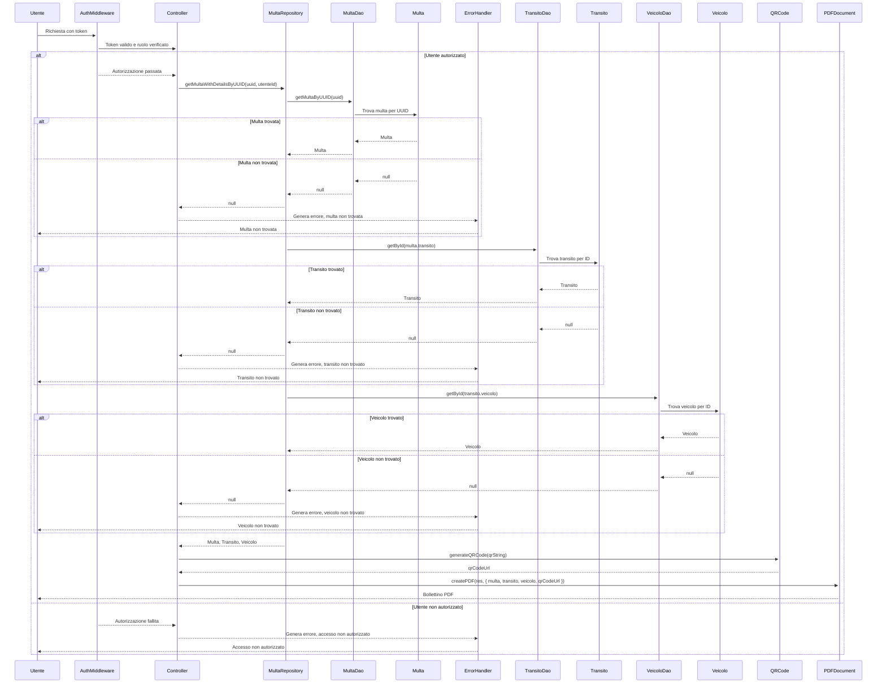

💳 **Backend-Pagamenti**

* __POST /pagamulta__

Questa chiamata di tipo POST si riferisce all'operazione di pagamento di una multa attraverso i crediti di un utente. Quest'ultimo invia una richiesta con token al middleware di autenticazione, che ne verifica la validità e il ruolo dell'utente. Se l'utente è autorizzato, passa il controllo al controller che richiede un'istanza del database e avvia una transazione.

Il Controller interroga il DAO delle multe per ottenere la multa corrispondente all'UUID fornito, utilizzando la transazione avviata. Se la multa viene trovata, il DAO la restituisce al controller. Se la multa non viene trovata, il DAO restituisce *null* al controller, che effettua un *rollback* della transazione, genera un errore tramite il gestore degli errori e informa l'utente che la multa non è stata trovata.

Se la multa viene trovata, il Controller verifica se la multa è già stata pagata. In tal caso, il Controller effettua un *rollback* della transazione, genera un errore tramite il gestore degli errori e informa l'utente che la multa è già stata pagata.

Se la multa non è stata pagata, il Controller interroga il DAO degli utenti per ottenere i dettagli dell'utente associato all'ID fornito, utilizzando la transazione avviata. Se l'utente viene trovato, il DAO lo restituisce al Controller. Se l'utente non viene trovato, il DAO restituisce *null* al Controller, che effettua un *rollback* della transazione, genera un errore tramite il gestore degli errori e informa l'utente che l'utente non è stato trovato.

Se l'utente viene trovato, il Controller verifica se esso ha un numero sufficiente di crediti per pagare la multa. Se l'utente ha credito sufficiente, il Controller aggiorna i crediti dell'utente e segna la multa come pagata. Successivamente, il Controller effettua il *commit* della transazione e informa l'utente che il pagamento è stato effettuato con successo.

Se l'utente non ha credito sufficiente, il Controller effettua un *rollback* della transazione, genera un errore tramite il gestore degli errori e informa l'utente che i crediti sono insufficienti.

Se l'utente non è autorizzato, l'`authMiddleware` comunica il fallimento dell'autorizzazione al Controller, che genera un errore tramite il gestore degli errori e informa l'utente che l'accesso non è autorizzato.

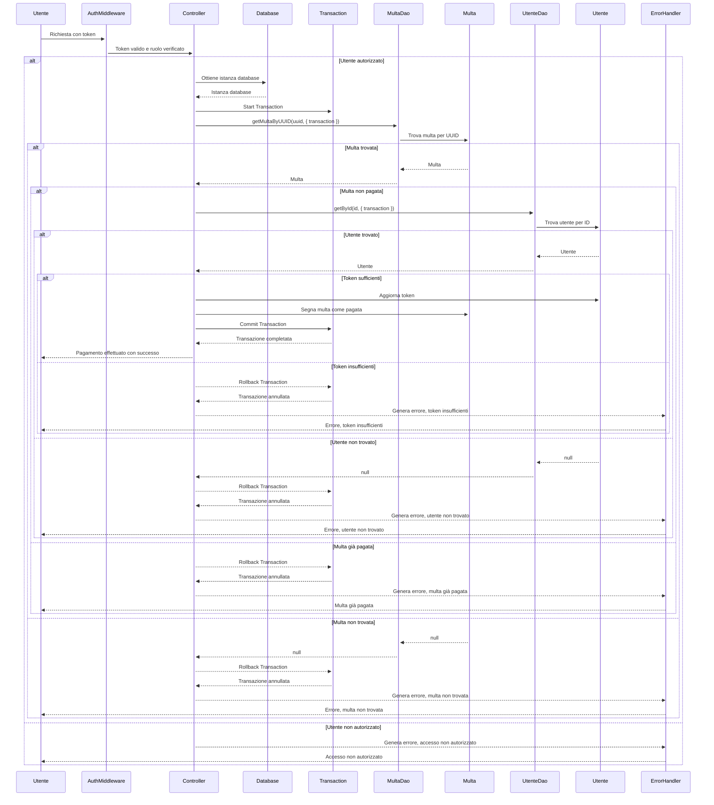

* __POST /ricaricatoken/:id__

Questa rotta POST si riferisce al processo di ricarica dei crediti di un certo utente, dato il suo ID. L'utente invia una richiesta con un token al middleware di autenticazione, che verifica la validità del token e il ruolo dell'utente. Se l'utente è autorizzato, viene passato il controllo al Controller, che richiede al DAO degli utenti di ricaricare i crediti per l'utente specificato dall'ID, utilizzando la quantità di token fornita nella richiesta.

Il DAO degli utenti cerca l'utente corrispondente all'ID fornito. Se l'utente viene trovato, il DAO aggiorna i token dell'utente e restituisce l'utente aggiornato al Controller. Il Controller informa quindi l'utente che i crediti sono stati ricaricati con successo.

Se l'utente non viene trovato, il DAO restituisce *null* al Controller, che genera un errore tramite l'`errorHandler` e informa che l'utente non è stato trovato.

Se l'utente non è autorizzato, il middleware comunica il fallimento dell'autorizzazione al Controller, che genera un errore tramite il gestore degli errori e informa l'utente che l'accesso non è autorizzato.

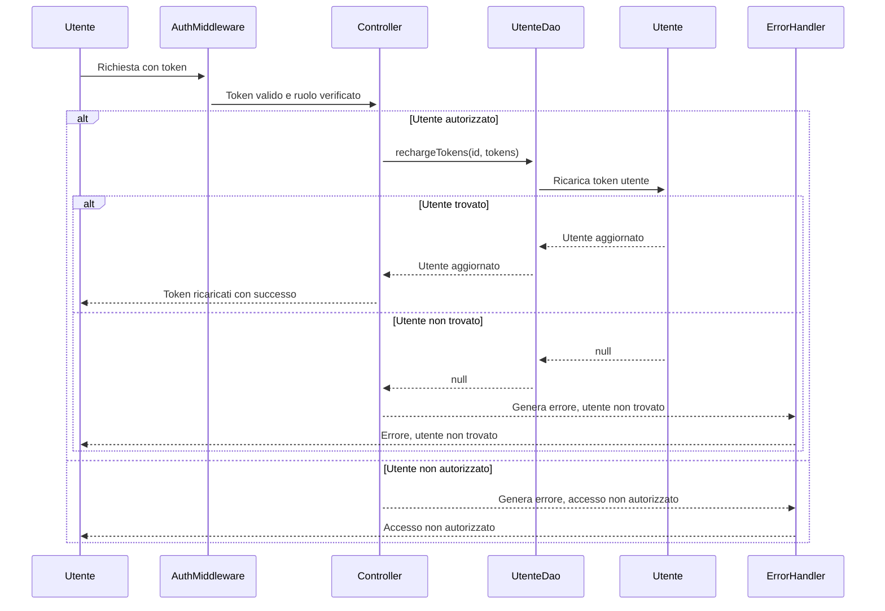

## 🔌 API Routes

All'interno del sistema sono state predisposte le rotte mostrate in tabella; ogni rotta prevede il processo di autenticazione tramite JWT e, oltretutto, sono previste autorizzazioni per ruolo diverse a seconda della rotta.


| Tipo | Rotta | Autenticazione | Autorizzazione | 
|-----------|--------|-----------|--------|
| `POST` | /login | ✔️ |    |
| `GET`  | /varcoZtl/:id?/:transiti? | ✔️ | Operatore |
| `POST`  | /varcoZtl | ✔️ | Operatore |
| `PUT`  | /varcoZtl/:id | ✔️ | Operatore |
| `DELETE`  | /varcoZtl/:id | ✔️ | Operatore |
| `GET`  | /zonaZtl/:id?/:transiti? | ✔️ | Operatore |
| `POST`  | /zonaZtl | ✔️ | Operatore |
| `PUT`  | /zonaZtl/:id | ✔️ | Operatore |
| `DELETE`  | /zonaZtl/:id | ✔️ | Operatore |
| `GET`  | /transito/:id? | ✔️ | Operatore |
| `POST`  | /transito | ✔️ | Operatore, Varco |
| `PUT`  | /transito/:id | ✔️ | Operatore |
| `DELETE`  | /transito/:id | ✔️ | Operatore |
| `GET`  | /multe/:uuid? | ✔️ | Automobilista |
| `GET`  | /tokenresidui | ✔️ | Automobilista |
| `POST`  | /pagamulta | ✔️ | Automobilista |
| `POST`  | /ricaricatoken/:id | ✔️ | Admin |

> **Nota**: Sono state implementate delle rotte aggiuntive all'interno del sistema, per permettere di visualizzare, aggiungere, aggiornare o cancellare informazioni ulteriori direttamente su Postman. Le CRUD aggiuntive riguardano le classi `veicolo`, `tipoVeicolo`, `orarioChiusura`, `utente`. Le suddette rotte sono state implementate solamente per scopi di completezza e di possibilità di personalizzazione in fase di test. 

### Login

*Rotta:*

```bash
```

*Richiesta:*

```bash
```

*Risposta:*

```bash
```

### VarcoZtl

**Get All Varchi**

*Rotta:*

```bash
```

*Richiesta:*

```bash
```

*Risposta:*

```bash
```

**Get Varco By Id**

*Rotta:*

```bash
```

*Richiesta:*

```bash
```

*Risposta:*

```bash
```

**Get Varco with Transiti**

*Rotta:*

```bash
```

*Richiesta:*

```bash
```

*Risposta:*

```bash
```

**Create Varco**

*Rotta:*

```bash
```

*Richiesta:*

```bash
```

*Risposta:*

```bash
```

**Update Varco**

*Rotta:*

```bash
```

*Richiesta:*

```bash
```

*Risposta:*

```bash
```

**Delete Varco**

*Rotta:*

```bash
```

*Richiesta:*

```bash
```

*Risposta:*

```bash
```

### ZonaZtl

**Get All Zone**

*Rotta:*

```bash
```

*Richiesta:*

```bash
```

*Risposta:*

```bash
```

**Get Zona By Id**

*Rotta:*

```bash
```

*Richiesta:*

```bash
```

*Risposta:*

```bash
```

**Get Zona with Transiti**

*Rotta:*

```bash
```

*Richiesta:*

```bash
```

*Risposta:*

```bash
```

**Create Zona**

*Rotta:*

```bash
```

*Richiesta:*

```bash
```

*Risposta:*

```bash
```

**Update Zona**

*Rotta:*

```bash
```

*Richiesta:*

```bash
```

*Risposta:*

```bash
```

**Delete Zona**

*Rotta:*

```bash
```

*Richiesta:*

```bash
```

*Risposta:*

```bash
```

### Transito

**Get All Transiti**

*Rotta:*

```bash
GET /transito
```

*Richiesta:*

```bash
Authorization: Bearer {authToken}
```

*Risposta:*

```bash
[
    {
        "id_transito": 1,
        "veicolo": {
            "targa": "AB123CD",
            "esente": false,
            "tipo_veicolo": 1,
            "utente": 1
        },
        "varco": {
            "id_varco": 1,
            "nome": "Varco 1",
            "via": "Via Roma",
            "zona_ztl": 1,
            "orario_chiusura": 1
        },
        "data_ora": "2024-07-07T08:30:00.000Z"
    },
    {
        "id_transito": 2,
        "veicolo": {
            "targa": "IJ789KL",
            "esente": true,
            "tipo_veicolo": 2,
            "utente": 2
        },
        "varco": {
            "id_varco": 2,
            "nome": "Varco 2",
            "via": "Via Milano",
            "zona_ztl": 1,
            "orario_chiusura": 2
        },
        "data_ora": "2024-07-07T09:00:00.000Z"
    },
    {
        "id_transito": 3,
        "veicolo": {
            "targa": "XY456ZT",
            "esente": false,
            "tipo_veicolo": 3,
            "utente": 3
        },
        "varco": {
            "id_varco": 3,
            "nome": "Varco 3",
            "via": "Via Napoli",
            "zona_ztl": 2,
            "orario_chiusura": 3
        },
        "data_ora": "2024-07-07T10:15:00.000Z"
    },
    {
        "id_transito": 4,
        "veicolo": {
            "targa": "MN234OP",
            "esente": true,
            "tipo_veicolo": 4,
            "utente": 4
        },
        "varco": {
            "id_varco": 4,
            "nome": "Varco 4",
            "via": "Via Torino",
            "zona_ztl": 3,
            "orario_chiusura": 1
        },
        "data_ora": "2024-07-07T11:45:00.000Z"
    }
]
```

**Get Transito By ID**

*Rotta:*

```bash
GET transito/1
```

*Richiesta:*

```bash
Authorization: Bearer {authToken}
```

*Risposta:*

```bash
{
    "id_transito": 1,
    "veicolo": {
        "targa": "AB123CD",
        "esente": false,
        "tipo_veicolo": 1,
        "utente": 1
    },
    "varco": {
        "id_varco": 1,
        "nome": "Varco 1",
        "via": "Via Roma",
        "zona_ztl": 1,
        "orario_chiusura": 1
    },
    "data_ora": "2024-07-07T08:30:00.000Z"
}
```

**Create Transito**

*Rotta:*

```bash
POST /transito
```

*Richiesta:*

```bash
Authorization: Bearer {authToken}
```
Nel body:

```bash
{
    "veicolo": "AB123CD",
    "varco": 1
    //"data_ora": "2024-07-15T13:01:04.115Z"
}
```
> `data_ora` è commentato poiché opzionale; se non inserito verrà preso in considerazione il valore *datetime* attuale. Inoltre, se il transito inserito rispetta i criteri per la generazione della multa (orario e giorno chiusura, veicolo non esente), prevede in automatico la generazione della multa associata al transito.

*Risposta:*

```bash
{
    "data_ora": "2024-07-16T14:28:36.452Z",
    "id_transito": 5,
    "veicolo": "AB123CD",
    "varco": 1
}
```

**Update Transito**


*Rotta:*

```bash
PUT /transito/5
```

*Richiesta:*

```bash
Authorization: Bearer {authToken}
```
Nel body:

```bash
{
    "veicolo": "IJ789KL",
    "varco": 1,
    "data_ora": "2024-07-15T12:01:04.115Z"
}
```

*Risposta:*

```bash
{
    "id_transito": 5,
    "veicolo": {
        "targa": "IJ789KL",
        "esente": true,
        "tipo_veicolo": 2,
        "utente": 2
    },
    "varco": {
        "id_varco": 1,
        "nome": "Varco 1",
        "via": "Via Roma",
        "zona_ztl": 1,
        "orario_chiusura": 1
    },
    "data_ora": "2024-07-15T12:01:04.115Z"
}
```

**Delete Transito**


*Rotta:*

```bash
DELETE transito/5
```

*Richiesta:*

```bash
Authorization: Bearer {authToken}
```

*Risposta:*

```bash
```

### Multe

**Get Multe By Utente**

*Rotta:*

```bash
GET /multe
```

*Richiesta:*

```bash
Authorization: Bearer {authToken}
```

*Risposta:*

```bash
[
    {
        "id_multa": 1,
        "transito": {
            "id_transito": 1,
            "veicolo": "AB123CD",
            "varco": 1,
            "data_ora": "2024-07-07T08:30:00.000Z"
        },
        "data_multa": "2024-07-07T10:00:00.000Z",
        "pagata": false,
        "importo_token": "5.00",
        "uuid_pagamento": "550e8400-e29b-41d4-a716-446655440000"
    }
]
```

**Get Multe By UUID**


*Rotta:*

```bash
GET multe/550e8400-e29b-41d4-a716-446655440000
```

*Richiesta:*

```bash
Authorization: Bearer {authToken}
```

*Risposta:*

```bash

```
> Se il bollettino ha lo stato pagamento aggiornato a `Pagato`, il colore del bollettino cambia in verde.

### Pagamenti

**Pay Multa**


*Rotta:*

```bash
POST /pagamulta
```

*Richiesta:*

```bash
Authorization: Bearer {authToken}
```

Nel body:

```bash
{
  "uuid": "550e8400-e29b-41d4-a716-446655440000"
}
```

*Risposta:*

```bash
{
    "esito": "Pagamento effettuato con successo da arianna.agresta@gmail.com",
    "multa": {
        "id_multa": 1,
        "transito": 1,
        "data_multa": "2024-07-07T10:00:00.000Z",
        "pagata": true,
        "importo_token": "5.00",
        "uuid_pagamento": "550e8400-e29b-41d4-a716-446655440000"
    },
    "token_rimanenti": 15
}
```

**Recharge Tokens**


*Rotta:*

```bash
POST /ricaricatoken/1
```

*Richiesta:*

```bash
Authorization: Bearer {authToken}
```

Nel body:

```bash
{
  "token": "1"
}
```

*Risposta:*

```bash
{
    "info": "Token ricaricati con successo",
    "utente": {
        "id_utente": 1,
        "nome": "Arianna",
        "cognome": "Agresta",
        "email": "arianna.agresta@gmail.com",
        "ruolo": "automobilista",
        "token_rimanenti": 16
    }
}
```

**Check Token**


*Rotta:*

```bash
GET /tokenresidui
```

*Richiesta:*

```bash
Authorization: Bearer {authToken}
```

*Risposta:*

```bash
{
    "utente": "arianna.agresta@gmail.com",
    "token_rimanenti": 15
}
```

## ⚙️ Set-up

## 📘 Scelte implementative da sottolineare

## 🛠️ Strumenti utilizzati

[](https://skillicons.dev)

## 👥 Autori 

|Nome | GitHub |
|-----------|--------|
| 👩 **Agresta Arianna** | [Click here](https://github.com/Arianna6400) |
| 👨 **Iasenzaniro Andrea** | [Click here](https://github.com/AndreaIasenzaniro) |
