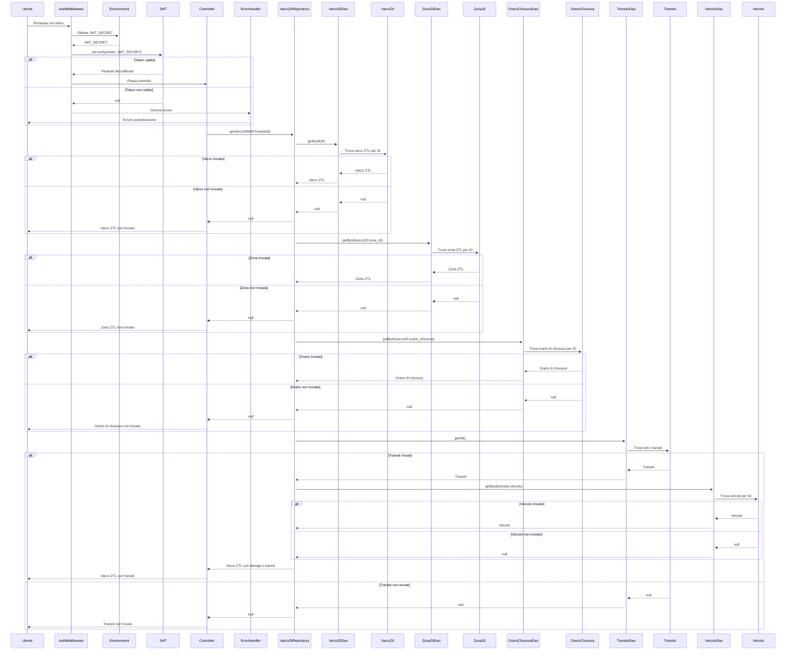

# Progetto Programmazione Avanzata A.A. 23/24

 

# Indice

- [Obiettivo](#-obiettivo)
- [Progettazione](#-progettazione)
   - [Architettura dei servizi](#-architettura-dei-servizi)
   - [Diagramma dei casi d'uso](#-diagramma-dei-casi-duso)
   - [Diagramma E-R](#-diagramma-e-r)
   - [Pattern utilizzati](#-pattern-utilizzati)
   - [Diagrammi delle sequenze](#-diagrammi-delle-sequenze)
- [API](#-api)
- [Set-up](#-set-up)
- [Strumenti utilizzati](#-strumenti-utilizzati)
- [Autori](#-autori)

## 📌 Obiettivo

L'obiettivo del progetto consiste nello sviluppo di un sistema per la gestione del calcolo delle multe dovute al passaggio di veicoli attraverso varchi ZTL (Zone a Traffico Limitato) in una città. Il sistema deve consentire:

* La gestione delle diverse tipologie di veicoli, ciascuna con costi di transito differenti.
* La modellazione dei varchi ZTL, che possono essere aperti o chiusi in specifici orari del giorno e della settimana. 
* L'inserimento dei transiti dei veicoli, con data e ora del passaggio e targa del veicolo.
* Il calcolo automatico delle multe in base alla tipologia del veicolo, alla fascia oraria e al giorno della settimana, tenendo conto di eventuali esenzioni di alcuni veicoli. Le tariffe relative ai varchi saranno differenziate anche a seconda del passaggio in giorni e orari festivi o feriali.

L'intero sistema prevede due backend distinti: uno per la gestione dei **transiti** e uno per la gestione dei **pagamenti** delle multe, ciascuno con funzionalità specifiche accessibili tramite rotte API.

## 🏗️ Progettazione

### 🖥️ Architettura dei servizi

Il diagramma rappresenta l'intera architettura del sistema sviluppato. All'interno della rete backend ci sono tre container principali, i quali rappresentano i servizi `Docker`, orchestrati tramite `docker-compose`, che compongono l'applicazione. 

Il container Transiti ospita un servizio chiamato "**backend-transiti**", accessibile all'indirizzo `transiti:3000`, mentre il container Pagamenti contiene il servizio "**backend-pagamenti**", accessibile all'indirizzo `pagamenti:3001`. Il container del DB, invece, contiene un database **PostgreSQL** accessibile all'indirizzo `db:5432`.

L'utente finale, rappresentato da un elemento separato nel diagramma, interagisce con il sistema inviando chiamate API sia al servizio backend-transiti sia al servizio backend-pagamenti. Entrambi questi servizi backend dipendono dal database PostgreSQL, il che significa che per funzionare correttamente devono poter accedere ai dati memorizzati in esso. Questa struttura permette una chiara separazione dei servizi e una gestione centralizzata dei dati tramite il database PostgreSQL.

### 📊 Diagramma dei casi d'uso

Il diagramma dei casi d'uso mostrato di seguito offre una visualizzazione delle funzioni e/o servizi offerti dal sistema sviluppato, a seconda del livello di utenza che interagisce col sistema stesso.

### 🗂️ Diagramma E-R

Il RDBMS scelto per la realizzazione del sistema è **PostgreSQL**, un database open source che gode di una solida reputazione per affidabilità, flessibilità e scalabilità. In particolare, in un contesto di backend puro come quello del sistema sviluppato, in cui è necessaria l'autenticazione dei dati e la velocità di lettura/scrittura, PostgreSQL è uno dei sistemi di basi di dati più efficiente e ottimizzato. 

Di seguito, viene mostrato il diagramma "Entity-Relationship"(E-R) di rappresentazione concettuale e grafica delle classi all'interno del database utilizzato.

### 🧱 Pattern utilizzati

**Model-View-Controller (MVC)**

Il pattern architetturale scelto per la struttura del sistema è il **Model-View-Controller** (**MVC**), il quale permette di separare la presentazione e l'interazione dai dati del sistema, facilitando la manutenzione e l'evoluzione del codice. L'utilizzo di questo pattern prevede la separazione dell'applicazione in tre componenti logiche che interagiscono tra loro:

* **Model**: Rappresenta i dati e la logica dell'applicazione. È responsabile della gestione dello stato e dell'interazione con il database. Nel caso del sistema sviluppato, i Model sono definiti utilizzando [Sequelize](https://sequelize.org/), un framework per l'Object-Relational Mapping (ORM) per interagire con il database.

* **Controller**: Gestisce l'interazione dell'utente e le operazioni CRUD (Create, Read, Update, Delete). Interagisce con i livelli sottostanti per eseguire le operazioni richieste e restituire le risposte appropriate. Nel sistema sviluppato, i Controller recuperano i dati necessari dai Repository (se previsti) o dai DAO, eseguendo le operazioni e i metodi specifici che verranno poi utilizzati dalle Routes API.

* **View**: Rappresenta i dati recuperati dal modello, gestendo la logica di presentazione. Nel caso specifico del sistema sviluppato, che risulta essere un backend puro, la componente logica della View non è stata propriamente sviluppata. Tuttavia, **Postman** viene utilizzato per fornire una visualizzazione dei dati in formato JSON, a seconda della richiesta inoltrata.

**Data Access Object (DAO)**

Per astrarre la logica di accesso ai dati, indipendentemente dal tipo di meccanismo di memorizzazione utilizzato, è stato scelto il pattern **Data Access Object** (**DAO**). Esso fornisce un'interfaccia astratta comune per eseguire operazioni CRUD e altre operazioni di accesso ai dati, isolando il codice di accesso ai dati dal codice di business.

Il DAO presenta diverse componenti: l'*interfaccia* di definizione dei metodi di accesso ai dati che devono essere implementati, l'*implementazione* concreta dei metodi definiti dall'interfaccia DAO che contiene il codice specifico di interazione con le fonti di dati e le *classi di entità*, cioè i Model, che rappresentano i dati che vengono manipolati dal DAO. Queste ultime classi sono mappate alle tabelle del database.

L'utilità principale del pattern è rappresentata dal fatto che ad un singolo Model viene corrisposto un singolo DAO, garantendo l'accesso ai dati necessari, e, soprattutto, uno o più DAO possono essere richiamati da componenti superiori quali **Repository** (se previsto) o **Controller**, per l'utilizzo combinato dell'accesso ai dati. In questo modo, non solo è garantita un'elevata riutilizzabilità del codice in diverse parti dell'applicazione, ma soprattutto viene implementata una forte modularità e separazione delle responsabilità da parte di tutte le componenti.

**Repository**

Per avere una centralizzazione della logica di accesso ai dati e offrire un'interfaccia coerente per il resto dell'applicazione, è stato utilizzato il pattern **Repository**, il quale fornisce un'astrazione dell'accesso ai dati, nascondendo i dettagli di come i dati vengono effettivamente recuperati o memorizzati. 

Centralizzando la logica di accesso ai dati, un Repository permette di trattare le entità come se fossero raccolte di memoria, fornendo metodi per aggiungere, rimuovere e recuperare oggetti. Al suo interno, il Repository fornisce l'implementazione concreta dei metodi necessari, utilizzando i DAO come tecnica di persistenza per l'interazione con le classi di dato.

Mentre il DAO lavora ad un livello più basso, vicino al database, per eseguire operazioni CRUD, il Repository fornisce un livello di astrazione superiore, incapsulando la logica di accesso ai dati e utilizzando uno o più DAO per realizzare le operazioni di persistenza. Il vantaggio principale del Repository consiste proprio nella capacità di astrazione sopra il livello di persistenza, consentendo di cambiare facilmente l'implementazione senza influenzare il resto dell'applicazione.

**Chain Of Responsability (COR)**

Il pattern **Chain of Responsability** (**COR**) è un design pattern comportamentale che permette di passare le richieste lungo catene di gestori, che sono rappresentati da oggetti che possono gestire la richiesta o passarla all'oggetto successivo della catena. L'utilizzo di questo pattern permette una gestione accurata delle richieste, senza l'effettiva conoscenza degli oggetti coinvolti da parte del mittente.

I *middleware*, in particolare, permettono la creazione della catena di responsabilità, poiché [Express.js](https://expressjs.com/) stesso fa un ampio uso di questo pattern. I middleware, infatti, sono funzioni che vengono eseguite in sequenza per gestire le richieste HTTP. Sfruttando il COR, sono state implementate le seguuenti funzionalità dei middleware:

* **Middleware di autenticazione**: Verifica se l'utente è autenticato e autorizzato a eseguire l'operazione richiesta, sfruttando la verifica tramite **JWT**. Se non lo è, restituisce una risposta di errore; altrimenti, passa la richiesta al prossimo middleware.

* **Middleware di validazione**: Viene utilizzato per validare i dati di una richiesta, che possono essere passati come `param` o `body`. Se i dati non sono validi, restituisce una risposta di errore; altrimenti, passa la richiesta al prossimo middleware.

* **Middleware di gestione degli errori**: Intercetta eventuali errori verificatisi nei middleware precedenti e restituisce una risposta di errore appropriata, sfruttando un `errorHandler` personalizzato con il pattern **Factory**.

**Factory**

Per la gestione personalizzata degli errori è stato scelto l'utilizzo del design pattern comportamentale **Factory**, il quale permette di delegare la creazione di oggetti a una factory (fabbrica), che decide quale tipo di oggetto creare in base a certi parametri. 

All'interno del sistema sviluppato, il pattern è stato utilizzato per la creazione di errori personalizzati attraverso l'`errorFactory`, che fornisce un metodo per creare istanze di errori `HttpError` con diversi tipi e messaggi, sfruttando anche l'utilizzo della libreria `http-status-code` per la stampa dei codici di errore, incapsulando la logica di creazione degli errori in un'unica classe. In questo modo, risulta particolarmente facilitata la gestione e la possibile estensione degli errori, essendo l'intera logica localizzata in un unico punto.

**Singleton**

Poiché l'intero sistema è composto da due backend distinti che condividono i dati dello stesso database e, di conseguenza, attingono dalla stessa fonte, è stato necessario l'utilizzo di un design pattern creazionale, chiamato **Singleton**, che garantisce la presenza di una classe con una sola istanza, che fornisce un punto di accesso globale ad essa. L'implementazione del pattern è stata eseguita proprio attraverso l'utilizzo del metodo `getInstance()`, il quale garantisce l'istanza di connessione condivisa al database.

Per la gestione delle risorse condivise, come la connessione al DB, questo pattern risulta particolarmente efficace. In questo modo, oltre a garantire una sola connessione condivisa tra le varie parti dell'applicazione, vengono evitati problemi di concorrenza e viene migliorata l'efficienza delle risorse.

### 🔄 Diagrammi delle sequenze

🚌 **Backend-Transiti**

* __POST /login__

* __GET /varchi/:id/transiti__

* __POST /varcoZtl__

* __DELETE /zonaZtl/:id__   

* __GET /transiti/:id__

* __POST /transiti__

* __GET /multe/bollettino/:uuid__

💳 **Backend-Pagamenti**

* __POST /pagamulta__

* __POST /ricaricatoken/:id__

## 🔌 API

## ⚙️ Set-up

## 🛠️ Strumenti utilizzati

## 👥 Autori 

|Nome | GitHub |
|-----------|--------|
| 👩 **Agresta Arianna** | [Click here](https://github.com/Arianna6400) |
| 👨 **Iasenzaniro Andrea** | [Click here](https://github.com/AndreaIasenzaniro) |
