# Progetto Programmazione Avanzata A.A. 23/24

 

# Indice

1. [Obiettivo](#-obiettivo)
2. [Progettazione](#-progettazione)
   1. [Architettura dei servizi](#-architettura-dei-servizi)
   2. [Diagramma dei casi d'uso](#-diagramma-dei-casi-duso)
   3. [Diagramma E-R](#-diagramma-e-r)
   4. [Diagrammi delle sequenze](#-diagrammi-delle-sequenze)
3. [API](#-api)
4. [Set-up](#-set-up)
5. [Strumenti utilizzati](#-strumenti-utilizzati)
6. [Autori](#-autori)

# 📌 Obiettivo

# 🏗️ Progettazione

## 🖥️ Architettura dei servizi


## 📊 Diagramma dei casi d'uso


## 🗂️ Diagramma E-R


## 🔄 Diagrammi delle sequenze

🚌 **Backend-Transiti**

* __POST /login__


* __GET /varchi/:id/transiti__

```mermaid
```

* __POST /varcoZtl__

```mermaid
```

* __DELETE /zonaZtl/:id__   

```mermaid
```

* __GET /transiti/:id__

```mermaid
sequenceDiagram
    participant U as Utente
    participant C as Controller
    participant R as TransitoRepository
    participant DAO_T as TransitoDao
    participant DAO_V as VeicoloDao
    participant DAO_Z as VarcoZtlDao
    participant T as Transito
    participant V as Veicolo
    participant Z as VarcoZtl
    participant Auth as AuthMiddleware
    participant Err as ErrorHandler
    participant JWT as JWT
    participant ENV as Environment

    U->>+Auth: Richiesta con token
    Auth->>+ENV: Ottiene JWT_SECRET
    ENV-->>Auth: JWT_SECRET
    Auth->>+JWT: jwt.verify(token, JWT_SECRET)
    alt Token valido
        JWT-->>Auth: Payload decodificato
        Auth->>C: Passa controllo
    else Token non valido
        JWT-->>Auth: null
        Auth-->>Err: Genera errore
        Err-->>U: Errore autenticazione
    end
    C->>+R: getTransitoById(id)
    R->>+DAO_T: getById(id)
    DAO_T->>+T: Trova transito per ID
    alt Transito trovato
        T-->>DAO_T: Transito
        DAO_T-->>R: Transito
    else Transito non trovato
        T-->>DAO_T: null
        DAO_T-->>R: null
        R-->>C: null
        C-->>U: Transito non trovato
    end
    R->>+DAO_V: getById(transito.veicolo)
    DAO_V->>+V: Trova veicolo per ID
    alt Veicolo trovato
        V-->>DAO_V: Veicolo
        DAO_V-->>R: Veicolo
    else Veicolo non trovato
        V-->>DAO_V: null
        DAO_V-->>R: null
        R-->>C: null
        C-->>U: Veicolo non trovato
    end
    R->>+DAO_Z: getById(transito.varco)
    DAO_Z->>+Z: Trova varco ZTL per ID
    alt Varco trovato
        Z-->>DAO_Z: Varco ZTL
        DAO_Z-->>R: Varco ZTL
    else Varco non trovato
        Z-->>DAO_Z: null
        DAO_Z-->>R: null
        R-->>C: null
        C-->>U: Varco non trovato
    end
    R-->>C: Transito, Veicolo, Varco ZTL
    C-->>U: Transito con dettagli
```

* __POST /transiti__


* __GET /multe/bollettino/:uuid__


💳 **Backend-Pagamenti**

* __POST /pagamulta__

```mermaid
sequenceDiagram
    participant U as Utente
    participant C as Controller
    participant DAO_M as MultaDao
    participant DAO_U as UtenteDao
    participant M as Multa
    participant DB as Database
    participant Auth as AuthMiddleware
    participant Err as ErrorHandler
    participant JWT as JWT
    participant ENV as Environment

    U->>+Auth: Richiesta con token
    Auth->>+ENV: Ottiene JWT_SECRET
    ENV-->>Auth: JWT_SECRET
    Auth->>+JWT: jwt.verify(token, JWT_SECRET)
    alt Token valido
        JWT-->>Auth: Payload decodificato
        Auth->>C: Passa controllo
    else Token non valido
        JWT-->>Auth: null
        Auth-->>Err: Genera errore
        Err-->>U: Errore autenticazione
    end
    C->>+DB: Start Transaction
    C->>+DAO_M: getMultaByUUID(uuid)
    DAO_M->>+M: Trova multa per UUID
    alt Multa trovata
        M-->>DAO_M: Multa
        DAO_M-->>C: Multa
    else Multa non trovata
        M-->>DAO_M: null
        DAO_M-->>C: null
        C->>DB: Rollback Transaction
        C-->>U: Multa non trovata
    end
    alt Multa già pagata
        C->>DB: Rollback Transaction
        C-->>U: Multa già pagata
    end
    C->>+DAO_U: getById(id)
    DAO_U->>+U: Trova utente per ID
    alt Utente trovato
        U-->>DAO_U: Utente
        DAO_U-->>C: Utente
    else Utente non trovato
        U-->>DAO_U: null
        DAO_U-->>C: null
        C->>DB: Rollback Transaction
        C-->>U: Utente non trovato
    end
    alt Token insufficienti
        C->>DB: Rollback Transaction
        C-->>U: Token insufficienti
    end
    C->>+DAO_U: Aggiorna token_rimanenti
    DAO_U->>U: Aggiorna token
    C->>+DAO_M: Aggiorna stato multa a pagata
    DAO_M->>M: Aggiorna stato multa
    C->>DB: Commit Transaction
    C-->>U: Pagamento effettuato con successo
```



* __POST /ricaricatoken/:id__


# 🔌 API

# ⚙️ Set-up

# 🛠️ Strumenti utilizzati

[](https://skillicons.dev)

# 👥 Autori 

|Nome | GitHub |
|-----------|--------|
| 👩 **Agresta Arianna** | [Click here](https://github.com/Arianna6400) |
| 👨 **Iasenzaniro Andrea** | [Click here](https://github.com/AndreaIasenzaniro) |
